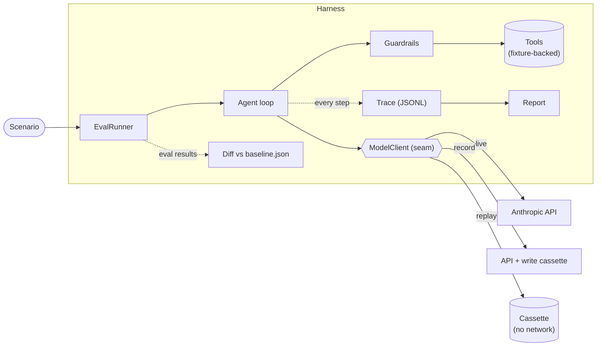

# DESIGN — agent-harness

## Architecture at a glance

The modules under `src/` (as built):

| Module | Responsibility |
|---|---|
| `agent/` | System prompt, tools + Gate-1 schemas + Gate-2 refund policy, the agentic loop, output schema, scenarios, fixture DB |
| `harness/model-client/` | The `ModelClient` seam + `LiveClient`, the error taxonomy (`classify`), defaults, fake client for tests |
| `harness/cassette/` | Fingerprint + `RecordingClient` / `ReplayClient` + the cassette store |
| `harness/trace/` | Typed event union, JSONL writer, cost table |
| `harness/eval/` | Scenario runner, trajectory + faithfulness assertions, shared trajectory helpers |
| `harness/report/` | Metrics, markdown + HTML report, baseline regression diff |

Dependency direction: the **agent depends on the harness's interfaces** (`ModelClient`, `Tracer`), never the reverse. The harness can wrap any agent that speaks those interfaces — that's the "this generalizes" claim, demonstrated by construction rather than by a plugin system.

---

## Decision 1 — Intercept at a typed client seam, not at the HTTP layer

**The choice:** record/replay happens at a `ModelClient` interface (`createMessage(request) → response` in SDK types), not by intercepting HTTP (nock / Polly.js / msw, VCR-style).

**Why:**
- **Cassettes are semantic, not wire-format.** A cassette entry is "this conversation state → this assistant message", in the SDK's own types. Reviewable in a PR; meaningful in a diff. HTTP cassettes are headers, auth noise, and SSE chunk framing.
- **Stability.** SDK internals (retries, streaming transport, header changes) don't invalidate recordings. HTTP interception couples your fixtures to the wire protocol du jour.
- **It's the production pattern.** A model-client seam is also where you'd hang failover, caching, rate-limit shaping, and provider abstraction in a real system. The test seam and the production seam are the same seam — that's the design argument.

**Trade-off accepted:** we only capture what crosses the interface. If the SDK itself misbehaved (serialization bug), replay wouldn't catch it. Acceptable: that's the SDK vendor's test surface, not ours.

## Decision 2 — Fingerprint matching, strict by default

**The choice:** each cassette entry is keyed by a **fingerprint**: a stable hash of `(model, system, messages, tools)` — canonical JSON, sorted keys. Replay looks up by fingerprint. A miss is a **hard, descriptive failure**, not a fallback.

**Why strict:** the tempting alternative is sequence-based replay ("serve responses in recorded order regardless of request"). Sequence replay keeps tests green when the prompt changes — which is exactly wrong. With strict matching, *any* change to the prompt, tool schemas, or conversation shape breaks replay loudly, and the failure message says what changed. **Prompt drift becomes a visible test event with a human decision attached: "intentional → `npm run record`, unintentional → you just caught a bug."** This is the single most load-bearing decision in the harness: it converts the scariest property of agent systems (silent behavioural drift) into an ordinary red build.

**Trade-offs accepted:**
- Intentional prompt changes require re-recording (one command, a handful of cheap Haiku calls). That friction is the feature — re-recording is a reviewed event, and the cassette diff shows you exactly how behaviour changed.
- Nondeterministic *inputs* (timestamps, generated IDs) would break fingerprints — so the agent's inputs are deterministic by design (fixture clock, fixed IDs). Noted in AGENTS.md as a hard rule.

**Cassette format:** one JSON file per scenario, an ordered list of `{fingerprint, request_summary, response}` entries. `request_summary` (truncated, human-oriented) exists purely so PR reviewers can read the diff without reconstructing the hash.

## Decision 3 — Own the agent loop (no SDK tool-runner, no framework)

**The choice:** the agentic loop (`while stop_reason == "tool_use"`) is ~80 lines of our own code, calling `ModelClient` directly. Not the SDK's beta tool-runner, not LangChain/LangGraph/Mastra.

**Why:** the loop is **where the harness lives**. Guardrails intercept between "model wants tool X" and "tool X executes"; the tracer records every hop; replay substitutes the client. A framework's loop hides exactly the seams this project exists to expose. For a harness role, owning the loop *is the work sample*. (The SDK tool-runner is noted in the docs as the right default for app code that doesn't need custom interception — this repo is precisely the case that does.)

## Decision 4 — Guardrails are a layer the model cannot bypass, and violations are recoverable

Covered fully in `GUARDRAILS.md`. The two design points that belong here:

- **Placement:** validation and policy run in the loop, between model output and tool execution. The model never has the option to skip them — they're not prompt instructions, they're code.
- **Violations return to the model as structured tool errors** rather than aborting the run. A production agent that hard-crashes on a blocked action is unusable; one that gets "refund blocked: exceeds €500 limit — escalate instead" recovers gracefully. The evals assert on both the block *and* the recovery.

## Decision 5 — Evals assert deterministically; no LLM judge

**The choice:** assertion priority is (1) trajectory checks — tool sequence, argument predicates, guardrail outcomes; (2) output schema validity; (3) **deterministic faithfulness checks** — the customer message must be consistent with the action and trace (`action=escalated` ⇒ it must not claim a refund happened; `action=refunded` ⇒ it references the refund). There is **no LLM judge.**

**Why (a decision changed mid-build):** the original plan had a recorded LLM judge for fuzzy qualities (tone, faithfulness). It was dropped. Faithfulness-to-trace — the safety-critical part — is *structurally checkable* without a model: it's the same "scoring matrix over outcomes" a deterministic eval already is. An LLM judge would add a nondeterministic dependency to chase a small residue (subtle prose quality) that isn't worth it, and it cuts against the harness's own thesis that agent behaviour should be tested *deterministically*. Keeping the eval layer model-free means the whole suite is exactly reproducible, not just mostly.

**Tradeoff accepted (stated so it's a choice, not an oversight):** a subtle *semantic* hallucination that is structurally consistent — a plausible-but-wrong detail that still matches the action — is not caught. That was the only class the judge would have added, and it's the flakiest to detect. Everything that changes an *outcome* is caught deterministically.

**Related — catching model drift:** the offline suite is frozen (replay), so it validates that *our* changes don't break known-good behaviour but cannot see the live model drift underneath us. A separate **live drift canary** re-runs the scenarios against the live model and applies the same deterministic checks, diffing the trajectory against the recorded baseline — that's what catches "a new model version stopped escalating." It needs a key, runs on a cadence, and is not part of offline CI.

## Decision 6 — Traces are typed events, reports are derived

Trace = append-only JSONL of a discriminated union (`run_started`, `model_request`, `model_response {usage, cost, latency_ms}`, `tool_call`, `guardrail_decision`, `tool_result`, `run_completed`). Cost is computed from usage × a small pricing table.

Reports (markdown per run + eval summary) are **pure functions of traces + eval results** — no logic of their own, so anything visible in a report is also assertable in a test. The hosted link serves the generated eval report (plus a browsable trace or two) as a static site — recommended target: Vercel, static output, nothing to keep alive.

## Decision 7 — Structured output via tool-forcing

The final `Resolution` is obtained by giving the agent a `resolve` tool with the output schema and requiring it as the terminal action. This keeps *everything* uniform — final output is just another validated tool call, guardrailable and trace-visible like the rest. (Alternative — the API's native structured-output `output_config.format` — is cleaner for single-shot extraction but splits the harness into "tool path" and "output path"; uniformity wins here.)

## Decision 8 — Error taxonomy: retry at the transport, re-prompt at the model, never both

**The choice:** every failure in the model path is classified into exactly one of four classes, each with its own recovery rule. The classification lives in the `ModelClient` wrapper (`LiveClient` normalizes SDK exceptions into a discriminated `ModelClientError` union), so the agent loop handles one error shape and the rules are testable in isolation.

| Class | Examples | Recovery | Owner |
|---|---|---|---|
| **Transport / capacity** | network drop, 429, 5xx, 529 overloaded | Retry with backoff — SDK `max_retries`, set explicitly; final failure ends the run, traced with retry count | `LiveClient` |
| **Request bugs** | 400 invalid request, 401 auth, 404 bad model ID | **Never retried** — retrying a config bug is a loop, not a recovery. Fail fast with the API's message | `LiveClient` |
| **Model behaviour** | schema-invalid tool args, unknown tool name, text-only reply when a tool call was required, `max_tokens` truncation, `refusal` stop reason | **Re-prompted, bounded**: structured error back to the model (max 2 re-prompts per run), then run fails with the last error traced. Truncation and refusal skip re-prompting — they fail the run immediately with a distinct traced reason | Agent loop + Gate 1 |
| **Harness invariants** | cassette fingerprint miss, cassette exhausted | **Never retried** — deterministic by definition. Fail immediately with a diff-friendly message | `ReplayClient` |

**The rule in the section title is the design:** transport problems are retried with the *same* request (idempotent, invisible to the model); model-behaviour problems are re-prompted with *new information* (the error appended to the conversation). Conflating the two — e.g. blindly re-sending on a validation failure — either burns money repeating a deterministic mistake or hides a prompt bug behind luck. Keeping the classes separate also keeps the trace honest: `model_retry` (transport) and `model_reprompt` (behaviour) are distinct event types with distinct counts in the report.

**Malformed JSON, specifically:** largely designed out rather than handled. Decision 7 means the harness never parses JSON from free text (the classic failure), and the SDK delivers tool arguments pre-parsed — so the residual class is *schema-invalid* arguments, which is Gate 1's job (GUARDRAILS.md). This is worth stating because it's a pattern: **prefer eliminating an error class by construction over handling it well.**

**Where the "generalized LLM wrapper" lives:** `LiveClient` is it — one place that owns SDK config, error normalization, and per-call trace emission (request, response, usage, computed cost, latency, retry count). Everything model-shaped in the system — agent and judge alike — goes through it, so logging and error semantics are uniform for free. Record/replay then decorates that same interface rather than being a parallel path.

**Sensible defaults, in one place.** Every tunable has an explicit default in a single `defaults.ts`, overridable per call site, never scattered as magic numbers. Whatever was in effect for a call is recorded in its trace event — a report never leaves you guessing which settings produced a run.

| Setting | Default | Rationale |
|---|---|---|
| Agent model | `claude-haiku-4-5` | Cheap, fast; replay makes live calls rare (SPEC.md) |
| `max_tokens` | 4096 | Generous for short tool-call turns; truncation is a run-failure, not a retry (taxonomy above) |
| `max_retries` (transport) | 3 | SDK-level, exponential backoff |
| Request timeout | 60 s | Well above Haiku latency; fail fast beats hanging CI |
| Re-prompt bound (behaviour) | 2 per run | Enough to recover from a one-off bad emission; more just burns money on a prompt bug |
| Loop iteration cap | 10 | Hard stop for tool-call loops that never resolve |
| Sampling params | unset | Prompt over sampling knobs; also keeps requests reproducible inputs for fingerprinting |

---

## Extension points (documented, not built)

Each non-goal maps to a seam that already exists: multi-provider (implement `ModelClient` for another SDK), streaming (a streaming `ModelClient` variant recording final messages), CI cost tracking (traces already carry cost — aggregate over time), human review queue (guardrail `escalate` decisions are structured events a queue could consume), semantic cassette matching for minor prompt edits (fingerprint the *structure*, embed the content — deliberately rejected for now: cleverness in the test seam erodes trust in it).

Two axes are out of scope here because the *agent* is, not because the harness can't reach them — worth naming so the choice is visible:

- **Perception / extraction eval.** A large class of agent unreliability is "did the model read the input correctly" — documents/OCR/messy text → structured data — which is a distinct axis from reasoning, and is best tested with synthetic inputs of escalating messiness. This agent takes clean structured inputs, so there's nothing to extract. But the scenario → assertion → cassette machinery generalizes to it unchanged: an extraction scenario just asserts on the parsed fields instead of the tool trajectory.
- **Tolerance / format-normalized assertions.** Amounts here are integer minor units *by design*, so the classic `500` vs `"500.00"` vs `"€500"` ambiguity can't arise — Gate 1's `z.number().int()` rejects the alternatives at the boundary. An agent that accepted free-form amounts would need tolerance/normalized comparison, which the argument-predicate API already supports (a predicate can normalize before comparing) — the seam is there; this agent just doesn't need it.
- **N-run canary sampling.** LLMs aren't bit-deterministic, so a single live canary run can miss an intermittent divergence. The canary takes an optional run count (`npm run canary <model> <runs>`) and samples, flagging a scenario that doesn't hold across all runs — the honest way to catch flapping behaviour rather than pretending one live run is a verdict.

---

## Built vs designed (reconciliation)

Every decision above shipped as written, with three noted refinements — recorded here so the design reads as honest, not retrofitted:

- **Decision 5 (no LLM judge) changed mid-build.** The original plan had a recorded Opus judge for fuzzy output quality; it was dropped for deterministic faithfulness checks (rationale in the decision itself). The one deliberate design→implementation reversal.
- **Decision 4 (guardrail placement) was sharpened.** To run Gate 2 *in the loop* between the model's proposal and execution, the tool interface split into `parse` (Gate 1, schema) / `run` / optional `policy` (Gate 2). The decision held; the mechanism got cleaner, and each gate became separately traceable.
- **Regression detection (Decision 6) grew a live arm.** The offline suite is frozen by design, so it can't see the *model* drift underneath us. A live drift canary re-runs the scenarios against the live model with N-run sampling and diffs the trajectory against the recorded baseline — added after a gap-analysis against prior eval work.

Everything else — the `ModelClient` seam, strict fingerprint matching, the hand-rolled loop, the retry/re-prompt error taxonomy, tool-forced structured output, and event-sourced traces → derived reports — shipped as designed. Two review agents (Phase 3, Phase 4) each caught a correctness bug the passing tests missed; both fixes shipped with a regression test in the same commit. That the harness's own construction was caught by adversarial review is, itself, the thesis.
